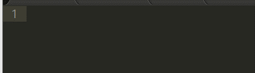

# SublimeSunippetter

SublimeSunippetter is generate Sublime Text2 simple sunippet from Sunippetfile DSL.

## Purpose

SublimeSunippetter can use following situations.

* You create dsl for team.

* You create some library for team.

* You create some open-source library.

If you provide sunippets for your users, they appreciate your kindness ...maybe.

## Installation

Add this line to your application's Gemfile:

    gem 'sublime_sunippetter'

And then execute:

    $ bundle

Or install it yourself as:

    $ gem install sublime_sunippetter

## Usage
### Generate
First, you create Sunippetfile manually or following command.

    suni init

Second, you have to edit Sunippetfile manually. 

~~~ruby
# encoding: utf-8

# set output path. default=current directory
output_path 'C:/Users/user_name/AppData/Roaming/Sublime Text 2/Packages/User'

# set sunippet scope. default=source.ruby
scope "source.ruby"

# if two args method
add :hoge, :args1, :args2
# if no args method
add :hige
# if two args method and do-block
add :hoge1, :args1, :args2, "block@d"
# if two args method and brace-block
add :hoge2, :args1, :args2, "block@b"
~~~

Third, you have to do is execute command 'suni'.

    suni

Result => generate hoge.sublime-snippet, hige.sublime-snippet

This Sample Sunppet Contens are ...

~~~xml
<snippet>
  <content><![CDATA[
hoge ${1:args1}, ${2:args2}
]]></content>
  <tabTrigger>hoge</tabTrigger>
  <scope>source.ruby</scope>
  <description>hoge method</description>
</snippet>
~~~

And

~~~xml
<snippet>
  <content><![CDATA[
hige
]]></content>
  <tabTrigger>hige</tabTrigger>
  <scope>source.ruby</scope>
  <description>hige method</description>
</snippet>
~~~

And

~~~xml
<snippet>
  <content><![CDATA[
hoge1 ${1:args1}, ${2:args2} do |${9:args}|
  ${0:block}
end
]]></content>
  <tabTrigger>hoge1</tabTrigger>
  <scope>source.ruby</scope>
  <description>hoge1 method</description>
</snippet>
~~~

And

~~~xml
<snippet>
  <content><![CDATA[
hoge2 ${1:args1}, ${2:args2} { |${9:args}|${0:block} }
]]></content>
  <tabTrigger>hoge2</tabTrigger>
  <scope>source.ruby</scope>
  <description>hoge2 method</description>
</snippet>
~~~

in 'C:/Users/user_name/AppData/Roaming/Sublime Text 2/Packages/User' directory.

## Use Generated Sunippet

## History
* version 0.0.4 : enable do-block, brace-block generate.
* version 0.0.3 : question can use. for ex 'blank?'.
* version 0.0.1 : first release.

## Contributing

1. Fork it
2. Create your feature branch (`git checkout -b my-new-feature`)
3. Commit your changes (`git commit -am 'Add some feature'`)
4. Push to the branch (`git push origin my-new-feature`)
5. Create new Pull Request
